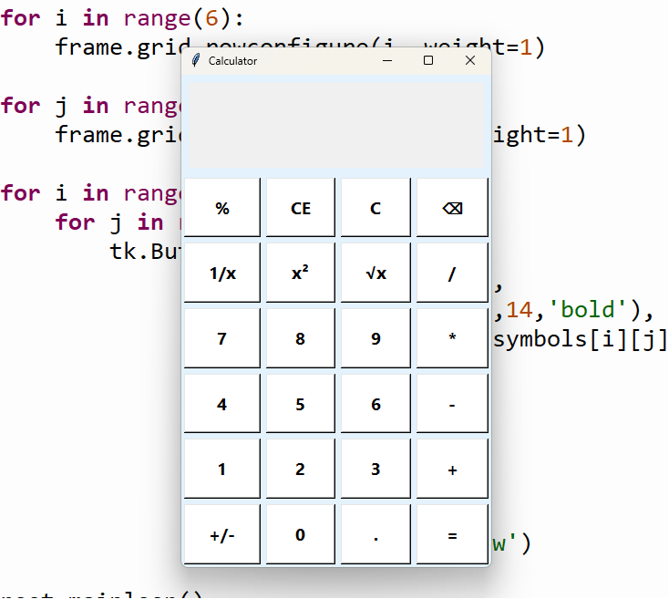

# Advanced Calculator using Python Tkinter

An advanced calculator built using Python Tkinter.

## Features
- Addition
- Subtraction
- Multiplication
- Division
- Percentage (%)
- Square (x²)
- Square Root (√x)
- Reciprocal (1/x)
- Sign Change (+/-)
- Backspace
- Error Handling

## Technologies Used
- Python
- Tkinter
- Math Module

## Screenshot

## Author
Sujatha Maripi
